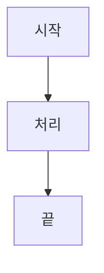

# 마크다운 → PDF 변환 정적 웹페이지 — 구현 계획서

> **For agentic workers:** REQUIRED SUB-SKILL: Use superpowers:subagent-driven-development (recommended) or superpowers:executing-plans to implement this plan task-by-task. Steps use checkbox (`- [ ]`) syntax for tracking.

**Goal:** 여러 마크다운(.md)을 폴더/파일로 등록해 미리보고, 브라우저 네이티브 인쇄로 고품질 PDF로 저장하는 순수 정적 웹페이지를 만든다.

**Architecture:** 빌드 도구 없이 네이티브 ES 모듈 + CDN(UMD 전역)으로 사이트를 구성한다. 순수 로직(파일 레지스트리·설정·마크다운 렌더·이미지 치환)은 라이브러리를 인자로 주입(DI)받는 모듈로 분리해 vitest로 단위 테스트한다. 브라우저 전용 글루(Mermaid·Paged.js·인쇄)는 수동 검증한다.

**Tech Stack:** HTML/CSS/Vanilla JS(ES Modules), markdown-it(+texmath), KaTeX, highlight.js, DOMPurify, Mermaid, Paged.js, Pretendard. 테스트: vitest + jsdom.

## Global Constraints

- 배포 산출물은 **빌드 없이** 동작해야 한다: `index.html`이 CDN UMD 스크립트를 전역으로 로드하고 `app.js`는 `<script type="module">`로 로드한다. (`npm`/번들러는 **테스트 전용**.)
- 순수 로직 모듈은 라이브러리를 **인자로 주입**받는다(전역 의존 금지). 브라우저는 `window.*` 전역을, 테스트는 npm 패키지를 주입한다.
- 변환 파이프라인 **순서 고정**: markdown-it(texmath, 코드 하이라이트는 markdown-it `highlight` 콜백에서 적용) → DOMPurify → DOM 주입 → 이미지 src 치환 → Mermaid → `document.fonts.ready` → Paged.js.
- 여백은 **Paged.js가 전담**. 인쇄용 CSS는 `@page { margin: 0 }`로 이중 적용 방지.
- `pre`, `table`, KaTeX 디스플레이, Mermaid SVG에 `break-inside: avoid`. 제목 `break-after: avoid`.
- 설정은 `localStorage` 저장, 변경 시 **300ms 디바운스** 후 재페이지네이션.
- 파일은 **상대경로를 키**로 보관(동명 파일 충돌 방지, 이미지 상대경로 해결).
- 생성한 ObjectURL은 교체/삭제 시 `revokeObjectURL`로 정리.
- 권장 브라우저: Chromium(Chrome/Edge). 비-Chromium은 안내 배너.
- 마크다운 확장: 표·취소선은 markdown-it 기본. **체크박스는 `markdown-it-task-lists`**, **각주는 `markdown-it-footnote`** 플러그인으로 지원.
- CDN 버전 고정(pin):
  - markdown-it `14.1.0`, markdown-it-texmath `1.0.0`, markdown-it-task-lists `2.1.1`,
    markdown-it-footnote `4.0.0`, katex `0.16.11`,
    dompurify `3.1.6`, highlight.js `11.10.0`, mermaid `11.3.0`, pagedjs `0.4.3`,
    pretendard `1.3.9`.

---

## 파일 구조

```
jomd2pdf/
├── index.html            # 마크업 + CDN(UMD) + module entry
├── style.css             # 화면 UI + @media print + @page
├── app.js                # 진입점: 전역 라이브러리 주입, 모듈 배선
├── src/
│   ├── files.js          # 파일 레지스트리: .md/이미지 분류, 상대경로 키, 이미지 해결
│   ├── settings.js       # 설정 모델, localStorage, CSS 변수/@page 적용
│   ├── render.js         # markdown→HTML 파이프라인, 이미지 치환, mermaid
│   └── paginate.js       # Paged.js 페이지네이션 + 인쇄
├── tests/
│   ├── smoke.test.js
│   ├── files.test.js
│   ├── settings.test.js
│   ├── render.test.js
│   └── paginate.test.js
├── fixtures/             # 수동 검증용 샘플 .md + 이미지
│   └── sample/
│       ├── note.md
│       └── img/diagram.png
├── README.md             # 사용법 + 배포 안내
├── package.json          # vitest/jsdom (테스트 전용 devDeps)
├── vitest.config.js
└── .gitignore
```

각 모듈 책임:
- **files.js**: 등록된 파일 목록(상대경로 포함)을 받아 `{mdFiles, images}` 레지스트리로 만들고, 마크다운 내 상대경로 이미지를 키로 해결한다. 순수 함수.
- **settings.js**: 설정 객체 ↔ localStorage ↔ CSS 변수/@page 문자열. 순수 + DOM 적용 함수.
- **render.js**: 주입된 라이브러리로 마크다운을 안전한 HTML로 렌더하고, 이미지 src를 ObjectURL로 치환하고, Mermaid를 렌더한다.
- **paginate.js**: Paged.js로 미리보기를 페이지 단위로 만들고 인쇄를 트리거한다.
- **app.js**: 전역 라이브러리를 모듈에 주입하고 UI(툴바·파일목록·설정패널)를 배선한다.

---

## Task 1: 프로젝트 스캐폴드 & 테스트 도구

**Files:**
- Create: `package.json`, `vitest.config.js`, `.gitignore`
- Create: `index.html`, `style.css`, `app.js` (스켈레톤)
- Create: `tests/smoke.test.js`

**Interfaces:**
- Produces: `npx vitest run`이 동작하는 테스트 환경. `index.html`이 CDN 라이브러리를 전역으로 로드.

- [ ] **Step 1: `.gitignore` 작성**

```
node_modules/
.superpowers/
.DS_Store
```

- [ ] **Step 2: `package.json` 작성**

```json
{
  "name": "jomd2pdf",
  "private": true,
  "type": "module",
  "scripts": {
    "test": "vitest run",
    "test:watch": "vitest",
    "serve": "python3 -m http.server 8080"
  },
  "devDependencies": {
    "vitest": "^2.1.0",
    "jsdom": "^25.0.0",
    "markdown-it": "^14.1.0",
    "markdown-it-texmath": "^1.0.0",
    "markdown-it-task-lists": "^2.1.1",
    "markdown-it-footnote": "^4.0.0",
    "katex": "^0.16.11",
    "dompurify": "^3.1.6",
    "highlight.js": "^11.10.0"
  }
}
```

- [ ] **Step 3: `vitest.config.js` 작성**

```js
import { defineConfig } from 'vitest/config'

export default defineConfig({
  test: {
    environment: 'node', // DOM이 필요한 파일은 상단에 `// @vitest-environment jsdom`
    include: ['tests/**/*.test.js'],
  },
})
```

- [ ] **Step 4: 의존성 설치**

Run: `cd ~/workspace/jomd2pdf && npm install`
Expected: `node_modules/` 생성, 에러 없음.

- [ ] **Step 5: 스모크 테스트 작성**

`tests/smoke.test.js`:
```js
import { describe, it, expect } from 'vitest'

describe('toolchain', () => {
  it('runs vitest', () => {
    expect(1 + 1).toBe(2)
  })
})
```

- [ ] **Step 6: 테스트 실행 확인**

Run: `npm test`
Expected: PASS (1 test).

- [ ] **Step 7: `index.html` 스켈레톤 작성**

```html
<!DOCTYPE html>
<html lang="ko">
<head>
  <meta charset="utf-8">
  <meta name="viewport" content="width=device-width, initial-scale=1">
  <title>MD → PDF 변환기</title>

  <!-- 한글 폰트: Pretendard(주) + Noto Sans KR(대체) -->
  <link rel="stylesheet" href="https://cdn.jsdelivr.net/gh/orioncactus/pretendard@1.3.9/dist/web/static/pretendard.css">
  <link rel="stylesheet" href="https://fonts.googleapis.com/css2?family=Noto+Sans+KR:wght@400;700&display=swap">
  <!-- KaTeX -->
  <link rel="stylesheet" href="https://cdn.jsdelivr.net/npm/katex@0.16.11/dist/katex.min.css">
  <!-- highlight.js 기본 테마(코드 테마는 동적으로 교체) -->
  <link rel="stylesheet" id="hljs-theme" href="https://cdn.jsdelivr.net/npm/highlight.js@11.10.0/styles/github.min.css">

  <link rel="stylesheet" href="./style.css">
</head>
<body>
  <header id="toolbar">
    <span class="brand">📄 MD → PDF</span>
    <input id="folder-input" type="file" webkitdirectory multiple hidden>
    <input id="file-input" type="file" accept=".md,image/*" multiple hidden>
    <button id="pick-folder">📁 폴더 선택</button>
    <button id="pick-files">＋ 파일 추가</button>
    <button id="toggle-settings">⚙ 설정</button>
    <button id="print-btn">🖨 인쇄</button>
  </header>

  <div id="settings-panel" hidden></div>
  <div id="browser-warning" hidden>이 도구는 Chrome/Edge에서 가장 정확하게 인쇄됩니다.</div>

  <main id="layout">
    <aside id="file-list"></aside>
    <section id="preview-wrap"><div id="preview"></div></section>
  </main>

  <!-- CDN UMD 전역 -->
  <script src="https://cdn.jsdelivr.net/npm/markdown-it@14.1.0/dist/markdown-it.min.js"></script>
  <script src="https://cdn.jsdelivr.net/npm/katex@0.16.11/dist/katex.min.js"></script>
  <script src="https://cdn.jsdelivr.net/npm/markdown-it-texmath@1.0.0/texmath.js"></script>
  <script src="https://cdn.jsdelivr.net/npm/markdown-it-task-lists@2.1.1/dist/markdown-it-task-lists.min.js"></script>
  <script src="https://cdn.jsdelivr.net/npm/markdown-it-footnote@4.0.0/dist/markdown-it-footnote.min.js"></script>
  <script src="https://cdn.jsdelivr.net/npm/dompurify@3.1.6/dist/purify.min.js"></script>
  <script src="https://cdn.jsdelivr.net/npm/highlight.js@11.10.0/lib/highlight.min.js"></script>
  <script src="https://cdn.jsdelivr.net/npm/mermaid@11.3.0/dist/mermaid.min.js"></script>
  <script src="https://cdn.jsdelivr.net/npm/pagedjs@0.4.3/dist/paged.polyfill.js"></script>

  <script type="module" src="./app.js"></script>
</body>
</html>
```

- [ ] **Step 8: `style.css` 베이스 작성**

```css
:root {
  --page-width: 210mm;
  --page-margin: 20mm;
  --body-font: "Pretendard", "Noto Sans KR", sans-serif;
  --body-size: 11pt;
  --line-height: 1.6;
}
* { box-sizing: border-box; }
body { margin: 0; font-family: var(--body-font); }
#toolbar { display: flex; gap: 8px; align-items: center; padding: 8px 12px; border-bottom: 1px solid #ddd; }
#toolbar .brand { font-weight: 700; margin-right: auto; }
#layout { display: flex; height: calc(100vh - 49px); }
#file-list { flex: 0 0 220px; overflow: auto; border-right: 1px solid #eee; padding: 8px; }
#preview-wrap { flex: 1; overflow: auto; background: #f3f4f6; padding: 16px; }
#preview { background: white; margin: 0 auto; }
```

- [ ] **Step 9: `app.js` 스켈레톤 작성**

```js
// 진입점: 이후 Task에서 모듈을 배선한다.
console.log('jomd2pdf loaded', {
  hasMarkdownit: typeof window.markdownit,
  hasMermaid: typeof window.mermaid,
  hasPaged: typeof window.PagedPolyfill,
})
```

- [ ] **Step 10: 로컬 서버로 로드 확인**

Run: `npm run serve` 후 브라우저에서 `http://localhost:8080` 접속, 콘솔 확인.
Expected: 콘솔에 `hasMarkdownit: "function"`, `hasMermaid: "object"`, Paged 전역 존재. 툴바가 보임.

- [ ] **Step 11: 커밋**

```bash
git add -A
git commit -m "chore: 프로젝트 스캐폴드 + vitest 도구 + index/스타일/CDN 골격"
```

---

## Task 2: 파일 레지스트리 (`src/files.js`)

**Files:**
- Create: `src/files.js`
- Test: `tests/files.test.js`

**Interfaces:**
- Produces:
  - `isMarkdown(name: string): boolean`
  - `isImage(name: string): boolean`
  - `normalizeKey(path: string): string` — 선행 `./` 제거, 백슬래시→슬래시.
  - `dirname(key: string): string` — 키의 디렉터리부("a/b/c.md" → "a/b", "x.md" → "").
  - `joinPath(dir: string, rel: string): string` — `.`/`..` 정규화 포함.
  - `buildRegistry(entries: {path, file}[]): { mdFiles: {key,name,file}[], images: Map<string,File> }`
  - `resolveImagePath(src: string, baseDir: string, images: Map<string,File>): File | null`
  - `groupByFolder(mdFiles: {key,name,file}[]): { folder: string, items: {key,name,file}[] }[]` — 파일을 디렉터리별로 묶어 폴더명 오름차순 정렬(루트는 `folder: ''`). 사이드바 그룹/들여쓰기 렌더용.

- [ ] **Step 1: 실패 테스트 작성**

`tests/files.test.js`:
```js
import { describe, it, expect } from 'vitest'
import {
  isMarkdown, isImage, normalizeKey, dirname, joinPath,
  buildRegistry, resolveImagePath, groupByFolder,
} from '../src/files.js'

describe('classification', () => {
  it('detects markdown', () => {
    expect(isMarkdown('a.md')).toBe(true)
    expect(isMarkdown('A.MD')).toBe(true)
    expect(isMarkdown('a.markdown')).toBe(true)
    expect(isMarkdown('a.txt')).toBe(false)
  })
  it('detects images', () => {
    expect(isImage('p.png')).toBe(true)
    expect(isImage('p.JPG')).toBe(true)
    expect(isImage('p.svg')).toBe(true)
    expect(isImage('p.md')).toBe(false)
  })
})

describe('path helpers', () => {
  it('normalizes keys', () => {
    expect(normalizeKey('./a/b.md')).toBe('a/b.md')
    expect(normalizeKey('a\\b.md')).toBe('a/b.md')
  })
  it('dirname', () => {
    expect(dirname('a/b/c.md')).toBe('a/b')
    expect(dirname('c.md')).toBe('')
  })
  it('joins and resolves .. and .', () => {
    expect(joinPath('a/b', './img.png')).toBe('a/b/img.png')
    expect(joinPath('a/b', '../img.png')).toBe('a/img.png')
    expect(joinPath('', 'img.png')).toBe('img.png')
  })
})

describe('buildRegistry', () => {
  it('splits md and images by relative path key', () => {
    const f = (n) => new File(['x'], n)
    const entries = [
      { path: '교육학/1강.md', file: f('1강.md') },
      { path: '교육학/img/d.png', file: f('d.png') },
      { path: '전공/1강.md', file: f('1강.md') },
      { path: 'readme.txt', file: f('readme.txt') },
    ]
    const reg = buildRegistry(entries)
    expect(reg.mdFiles.map(m => m.key)).toEqual(['교육학/1강.md', '전공/1강.md'])
    expect(reg.images.has('교육학/img/d.png')).toBe(true)
    expect(reg.images.size).toBe(1)
  })
})

describe('resolveImagePath', () => {
  const f = (n) => new File(['x'], n)
  const images = new Map([
    ['교육학/img/d.png', f('d.png')],
    ['전공/p.png', f('p.png')],
  ])
  it('resolves relative path against md baseDir', () => {
    expect(resolveImagePath('./img/d.png', '교육학', images)).toBe(images.get('교육학/img/d.png'))
    expect(resolveImagePath('img/d.png', '교육학', images)).toBe(images.get('교육학/img/d.png'))
  })
  it('falls back to basename match', () => {
    expect(resolveImagePath('weird/path/p.png', '없는폴더', images)).toBe(images.get('전공/p.png'))
  })
  it('returns null for http urls', () => {
    expect(resolveImagePath('https://x/y.png', '교육학', images)).toBe(null)
  })
  it('returns null when nothing matches', () => {
    expect(resolveImagePath('nope.png', '교육학', images)).toBe(null)
  })
})

describe('groupByFolder', () => {
  const f = (n) => new File(['x'], n)
  it('groups md files by directory, sorted', () => {
    const mdFiles = [
      { key: '전공/1강.md', name: '1강.md', file: f('1강.md') },
      { key: '교육학/2강.md', name: '2강.md', file: f('2강.md') },
      { key: '교육학/1강.md', name: '1강.md', file: f('1강.md') },
      { key: 'intro.md', name: 'intro.md', file: f('intro.md') },
    ]
    const groups = groupByFolder(mdFiles)
    expect(groups.map(g => g.folder)).toEqual(['', '교육학', '전공'])
    expect(groups[1].items.map(i => i.key)).toEqual(['교육학/2강.md', '교육학/1강.md'])
  })
})
```

- [ ] **Step 2: 테스트 실패 확인**

Run: `npx vitest run tests/files.test.js`
Expected: FAIL ("Failed to resolve import '../src/files.js'").

- [ ] **Step 3: `src/files.js` 구현**

```js
const MD_EXT = /\.(md|markdown)$/i
const IMG_EXT = /\.(png|jpe?g|gif|svg|webp|bmp)$/i

export const isMarkdown = (name) => MD_EXT.test(name)
export const isImage = (name) => IMG_EXT.test(name)

export const normalizeKey = (path) =>
  path.replace(/\\/g, '/').replace(/^\.\//, '')

export const dirname = (key) => {
  const i = key.lastIndexOf('/')
  return i === -1 ? '' : key.slice(0, i)
}

const basename = (key) => key.slice(key.lastIndexOf('/') + 1)

export const joinPath = (dir, rel) => {
  const parts = (dir ? dir.split('/') : []).concat(rel.split('/'))
  const out = []
  for (const p of parts) {
    if (p === '' || p === '.') continue
    if (p === '..') out.pop()
    else out.push(p)
  }
  return out.join('/')
}

export const buildRegistry = (entries) => {
  const mdFiles = []
  const images = new Map()
  for (const { path, file } of entries) {
    const key = normalizeKey(path)
    if (isMarkdown(key)) mdFiles.push({ key, name: basename(key), file })
    else if (isImage(key)) images.set(key, file)
  }
  return { mdFiles, images }
}

export const resolveImagePath = (src, baseDir, images) => {
  if (/^[a-z]+:\/\//i.test(src) || src.startsWith('data:')) return null
  const full = joinPath(baseDir, normalizeKey(src))
  if (images.has(full)) return images.get(full)
  const base = basename(normalizeKey(src))
  for (const [key, file] of images) {
    if (basename(key) === base) return file
  }
  return null
}

export const groupByFolder = (mdFiles) => {
  const map = new Map()
  for (const m of mdFiles) {
    const folder = dirname(m.key)
    if (!map.has(folder)) map.set(folder, [])
    map.get(folder).push(m)
  }
  return [...map.keys()]
    .sort((a, b) => a.localeCompare(b))
    .map((folder) => ({ folder, items: map.get(folder) }))
}
```

- [ ] **Step 4: 테스트 통과 확인**

Run: `npx vitest run tests/files.test.js`
Expected: PASS (모든 테스트).

- [ ] **Step 5: 커밋**

```bash
git add src/files.js tests/files.test.js
git commit -m "feat: 파일 레지스트리 — md/이미지 분류, 상대경로 키, 이미지 해결"
```

---

## Task 3: 설정 모델 (`src/settings.js`)

**Files:**
- Create: `src/settings.js`
- Test: `tests/settings.test.js`

**Interfaces:**
- Produces:
  - `DEFAULT_SETTINGS` — `{ paper, orientation, marginMm, bodyFont, bodySizePt, lineHeight, codeTheme, showPageNumber, showTitleHeader }`
  - `loadSettings(storage): object` — 기본값 + 저장값 병합.
  - `saveSettings(storage, settings): void`
  - `pageDimensions(settings): { width: string, height: string }` — `@page size`용 mm 문자열.
  - `applySettings(settings, root): void` — `root`(예: document.documentElement)에 CSS 변수 세팅.

- [ ] **Step 1: 실패 테스트 작성**

`tests/settings.test.js`:
```js
// @vitest-environment jsdom
import { describe, it, expect, beforeEach } from 'vitest'
import {
  DEFAULT_SETTINGS, loadSettings, saveSettings, pageDimensions, applySettings,
} from '../src/settings.js'

const fakeStorage = () => {
  const m = new Map()
  return {
    getItem: (k) => (m.has(k) ? m.get(k) : null),
    setItem: (k, v) => m.set(k, v),
  }
}

describe('settings persistence', () => {
  let storage
  beforeEach(() => { storage = fakeStorage() })

  it('returns defaults when storage empty', () => {
    expect(loadSettings(storage)).toEqual(DEFAULT_SETTINGS)
  })
  it('merges saved over defaults', () => {
    saveSettings(storage, { ...DEFAULT_SETTINGS, marginMm: 30 })
    expect(loadSettings(storage).marginMm).toBe(30)
    expect(loadSettings(storage).paper).toBe(DEFAULT_SETTINGS.paper)
  })
  it('ignores corrupt storage', () => {
    storage.setItem('jomd2pdf:settings', '{not json')
    expect(loadSettings(storage)).toEqual(DEFAULT_SETTINGS)
  })
})

describe('pageDimensions', () => {
  it('A4 portrait', () => {
    expect(pageDimensions({ ...DEFAULT_SETTINGS, paper: 'A4', orientation: 'portrait' }))
      .toEqual({ width: '210mm', height: '297mm' })
  })
  it('A4 landscape swaps', () => {
    expect(pageDimensions({ ...DEFAULT_SETTINGS, paper: 'A4', orientation: 'landscape' }))
      .toEqual({ width: '297mm', height: '210mm' })
  })
  it('Letter portrait', () => {
    expect(pageDimensions({ ...DEFAULT_SETTINGS, paper: 'Letter', orientation: 'portrait' }))
      .toEqual({ width: '215.9mm', height: '279.4mm' })
  })
})

describe('applySettings', () => {
  it('writes CSS variables to root', () => {
    const root = document.documentElement
    applySettings({ ...DEFAULT_SETTINGS, marginMm: 25, bodySizePt: 12 }, root)
    expect(root.style.getPropertyValue('--page-margin')).toBe('25mm')
    expect(root.style.getPropertyValue('--body-size')).toBe('12pt')
  })
})
```

- [ ] **Step 2: 테스트 실패 확인**

Run: `npx vitest run tests/settings.test.js`
Expected: FAIL (import 실패).

- [ ] **Step 3: `src/settings.js` 구현**

```js
const KEY = 'jomd2pdf:settings'

export const DEFAULT_SETTINGS = {
  paper: 'A4',
  orientation: 'portrait',
  marginMm: 20,
  bodyFont: 'Pretendard',
  bodySizePt: 11,
  lineHeight: 1.6,
  codeTheme: 'github',
  showPageNumber: true,
  showTitleHeader: false,
}

const PAPER = {
  A4: { width: 210, height: 297 },
  Letter: { width: 215.9, height: 279.4 },
}

export const loadSettings = (storage) => {
  try {
    const raw = storage.getItem(KEY)
    if (!raw) return { ...DEFAULT_SETTINGS }
    return { ...DEFAULT_SETTINGS, ...JSON.parse(raw) }
  } catch {
    return { ...DEFAULT_SETTINGS }
  }
}

export const saveSettings = (storage, settings) => {
  storage.setItem(KEY, JSON.stringify(settings))
}

export const pageDimensions = (settings) => {
  const p = PAPER[settings.paper] || PAPER.A4
  const [w, h] = settings.orientation === 'landscape'
    ? [p.height, p.width] : [p.width, p.height]
  return { width: `${w}mm`, height: `${h}mm` }
}

export const applySettings = (settings, root) => {
  const { width } = pageDimensions(settings)
  root.style.setProperty('--page-width', width)
  root.style.setProperty('--page-margin', `${settings.marginMm}mm`)
  root.style.setProperty('--body-font', `"${settings.bodyFont}", "Noto Sans KR", sans-serif`)
  root.style.setProperty('--body-size', `${settings.bodySizePt}pt`)
  root.style.setProperty('--line-height', String(settings.lineHeight))
}
```

- [ ] **Step 4: 테스트 통과 확인**

Run: `npx vitest run tests/settings.test.js`
Expected: PASS.

- [ ] **Step 5: 커밋**

```bash
git add src/settings.js tests/settings.test.js
git commit -m "feat: 설정 모델 — localStorage 병합, 용지 치수, CSS 변수 적용"
```

---

## Task 4: 마크다운 렌더 파이프라인 (`src/render.js`)

**Files:**
- Create: `src/render.js`
- Test: `tests/render.test.js`

**Interfaces:**
- Consumes: `resolveImagePath`, `dirname` (from `src/files.js`)
- Produces:
  - `createRenderer(deps): { renderMarkdown(text: string): string }`
    - `deps = { markdownit, texmath, katex, hljs, DOMPurify, taskLists, footnote }`
    - `renderMarkdown`은 markdown-it(texmath+task-lists+footnote+highlight) 렌더 후 DOMPurify로 정화한 **HTML 문자열** 반환.
  - `rewriteImageSources(container: HTMLElement, baseDir: string, images: Map, objectUrls: string[]): void`
    - 컨테이너 내 ``의 상대경로 src를 ObjectURL로 치환, 만든 URL을 `objectUrls`에 push, 매칭 실패 시 플레이스홀더 처리.
  - `async renderMermaid(container, mermaid): Promise<void>` — `code.language-mermaid` 블록을 SVG로 교체(오류 시 블록에 에러 표시).

- [ ] **Step 1: 실패 테스트 작성**

`tests/render.test.js`:
```js
// @vitest-environment jsdom
import { describe, it, expect } from 'vitest'
import { JSDOM } from 'jsdom'
import markdownit from 'markdown-it'
import texmath from 'markdown-it-texmath'
import katex from 'katex'
import hljs from 'highlight.js'
import createDOMPurify from 'dompurify'
import taskLists from 'markdown-it-task-lists'
import footnote from 'markdown-it-footnote'
import { createRenderer, rewriteImageSources } from '../src/render.js'

const DOMPurify = createDOMPurify(new JSDOM('').window)
const renderer = createRenderer({ markdownit, texmath, katex, hljs, DOMPurify, taskLists, footnote })

describe('renderMarkdown', () => {
  it('renders headings and GFM tables', () => {
    const html = renderer.renderMarkdown('# 제목\n\n| a | b |\n|---|---|\n| 1 | 2 |')
    expect(html).toContain('<h1>제목</h1>')
    expect(html).toContain('<table>')
  })
  it('renders inline math via KaTeX (not mangled by markdown)', () => {
    const html = renderer.renderMarkdown('식 $a_i = b_j$ 끝')
    expect(html).toContain('katex')
    expect(html).not.toContain('<em>') // _i_ 가 기울임으로 안 바뀜
  })
  it('strips dangerous html', () => {
    const html = renderer.renderMarkdown('\n\n텍스트')
    expect(html).not.toContain('onerror')
  })
  it('renders GFM task list checkboxes', () => {
    const html = renderer.renderMarkdown('- [ ] 미완료\n- [x] 완료')
    expect(html).toContain('type="checkbox"')
    expect(html).toContain('checked')
  })
  it('renders footnotes', () => {
    const html = renderer.renderMarkdown('본문[^1]\n\n[^1]: 각주 내용')
    expect(html).toContain('footnote')
  })
})

describe('rewriteImageSources', () => {
  it('replaces relative img src with object url and tracks for cleanup', () => {
    const created = []
    globalThis.URL.createObjectURL = () => 'blob:fake-123'
    const div = document.createElement('div')
    div.innerHTML = ''
    const images = new Map([['교육학/img/d.png', new File(['x'], 'd.png')]])
    const urls = []
    rewriteImageSources(div, '교육학', images, urls)
    expect(div.querySelector('img').getAttribute('src')).toBe('blob:fake-123')
    expect(urls).toEqual(['blob:fake-123'])
  })
  it('marks missing images', () => {
    const div = document.createElement('div')
    div.innerHTML = ''
    const urls = []
    rewriteImageSources(div, '교육학', new Map(), urls)
    expect(div.querySelector('img').getAttribute('data-missing')).toBe('true')
  })
  it('leaves http src untouched', () => {
    const div = document.createElement('div')
    div.innerHTML = ''
    const urls = []
    rewriteImageSources(div, '교육학', new Map(), urls)
    expect(div.querySelector('img').getAttribute('src')).toBe('https://x/y.png')
  })
})
```

- [ ] **Step 2: 테스트 실패 확인**

Run: `npx vitest run tests/render.test.js`
Expected: FAIL (import 실패).

- [ ] **Step 3: `src/render.js` 구현**

```js
import { resolveImagePath } from './files.js'

export const createRenderer = (deps) => {
  const { markdownit, texmath, katex, hljs, DOMPurify, taskLists, footnote } = deps

  const md = markdownit({
    html: true,
    linkify: true,
    highlight: (code, lang) => {
      if (lang === 'mermaid') {
        // 코드 그대로 두고 mermaid 단계에서 처리
        return `<pre class="mermaid-src"><code class="language-mermaid">${md.utils.escapeHtml(code)}</code></pre>`
      }
      if (lang && hljs.getLanguage(lang)) {
        try {
          return `<pre><code class="hljs language-${lang}">${hljs.highlight(code, { language: lang }).value}</code></pre>`
        } catch {}
      }
      return `<pre><code class="hljs">${md.utils.escapeHtml(code)}</code></pre>`
    },
  })
  md.use(texmath, { engine: katex, delimiters: 'dollars' })
  md.use(taskLists, { label: true })
  md.use(footnote)

  const renderMarkdown = (text) => {
    const raw = md.render(text)
    return DOMPurify.sanitize(raw, { ADD_TAGS: ['foreignObject'] })
  }

  return { renderMarkdown }
}

export const rewriteImageSources = (container, baseDir, images, objectUrls) => {
  for (const img of container.querySelectorAll('img')) {
    const src = img.getAttribute('src') || ''
    if (/^[a-z]+:\/\//i.test(src) || src.startsWith('data:')) continue
    const file = resolveImagePath(src, baseDir, images)
    if (file) {
      const url = URL.createObjectURL(file)
      objectUrls.push(url)
      img.setAttribute('src', url)
    } else {
      img.setAttribute('data-missing', 'true')
      img.removeAttribute('src')
      img.setAttribute('alt', `(이미지 없음: ${src})`)
    }
  }
}

export const renderMermaid = async (container, mermaid) => {
  const blocks = container.querySelectorAll('code.language-mermaid')
  let i = 0
  for (const code of blocks) {
    const pre = code.closest('pre')
    const def = code.textContent
    try {
      const { svg } = await mermaid.render(`mmd-${i++}`, def)
      const wrap = document.createElement('div')
      wrap.className = 'mermaid-rendered'
      wrap.innerHTML = svg
      pre.replaceWith(wrap)
    } catch (e) {
      const err = document.createElement('div')
      err.className = 'mermaid-error'
      err.textContent = `Mermaid 오류: ${e.message || e}`
      pre.replaceWith(err)
    }
  }
}
```

- [ ] **Step 4: 테스트 통과 확인**

Run: `npx vitest run tests/render.test.js`
Expected: PASS. (`renderMermaid`는 브라우저 의존이라 Task 7에서 수동 검증.)

- [ ] **Step 5: 커밋**

```bash
git add src/render.js tests/render.test.js
git commit -m "feat: 렌더 파이프라인 — markdown-it+texmath+DOMPurify, 이미지 치환, mermaid"
```

---

## Task 5: 페이지네이션 & 인쇄 (`src/paginate.js`)

**Files:**
- Create: `src/paginate.js`
- Modify: `style.css` (인쇄/페이지 CSS 추가)

**Interfaces:**
- Produces:
  - `async paginate({ html, settings, previewEl, Paged }): Promise<void>`
    - `previewEl`을 비우고 Paged.js `Previewer`로 `html`을 페이지 단위 렌더. `@page` 크기/여백/페이지번호/머리말은 동적 `<style id="paged-page-rules">`로 주입.
  - `print(): void` — `window.print()`.
- 이 Task는 브라우저 전용이라 단위 테스트 대신 Task 7에서 수동 검증. (page-rules 문자열을 만드는 `buildPageRules(settings)`만 순수 함수로 분리해 테스트 가능하게 둔다.)

- [ ] **Step 1: `buildPageRules` 실패 테스트 작성**

`tests/paginate.test.js`:
```js
import { describe, it, expect } from 'vitest'
import { buildPageRules } from '../src/paginate.js'
import { DEFAULT_SETTINGS } from '../src/settings.js'

describe('buildPageRules', () => {
  it('sets size and margin from settings', () => {
    const css = buildPageRules({ ...DEFAULT_SETTINGS, paper: 'A4', marginMm: 25 })
    expect(css).toContain('size: 210mm 297mm')
    expect(css).toContain('margin: 25mm')
  })
  it('adds page number when enabled', () => {
    const css = buildPageRules({ ...DEFAULT_SETTINGS, showPageNumber: true })
    expect(css).toContain('@bottom-center')
    expect(css).toContain('counter(page)')
  })
  it('omits page number when disabled', () => {
    const css = buildPageRules({ ...DEFAULT_SETTINGS, showPageNumber: false })
    expect(css).not.toContain('@bottom-center')
  })
})
```

- [ ] **Step 2: 테스트 실패 확인**

Run: `npx vitest run tests/paginate.test.js`
Expected: FAIL (import 실패).

- [ ] **Step 3: `src/paginate.js` 구현**

```js
import { pageDimensions } from './settings.js'

export const buildPageRules = (settings) => {
  const { width, height } = pageDimensions(settings)
  const pageNum = settings.showPageNumber
    ? `@bottom-center { content: counter(page); font-size: 9pt; color: #666; }`
    : ''
  const header = settings.showTitleHeader
    ? `@top-center { content: string(doctitle); font-size: 9pt; color: #888; }`
    : ''
  return `
@page {
  size: ${width} ${height};
  margin: ${settings.marginMm}mm;
  ${pageNum}
  ${header}
}`
}

export const paginate = async ({ html, settings, previewEl, Paged }) => {
  // 동적 @page 규칙 주입(교체)
  let styleEl = document.getElementById('paged-page-rules')
  if (!styleEl) {
    styleEl = document.createElement('style')
    styleEl.id = 'paged-page-rules'
    document.head.appendChild(styleEl)
  }
  styleEl.textContent = buildPageRules(settings)

  previewEl.innerHTML = ''
  const source = document.createElement('template')
  source.innerHTML = html
  const previewer = new Paged.Previewer()
  await previewer.preview(source.content, [], previewEl)
}

export const print = () => window.print()
```

- [ ] **Step 4: 테스트 통과 확인**

Run: `npx vitest run tests/paginate.test.js`
Expected: PASS (`buildPageRules` 3개).

- [ ] **Step 5: `style.css`에 인쇄/페이지 나눔 CSS 추가**

```css
/* 미리보기 본문 타이포 */
#preview .pagedjs_page_content { font-size: var(--body-size); line-height: var(--line-height); }
#preview h1, #preview h2, #preview h3 { break-after: avoid; }
#preview pre, #preview table, #preview .katex-display,
#preview .mermaid-rendered, #preview img { break-inside: avoid; }
#preview img, #preview .mermaid-rendered svg { max-width: 100%; height: auto; }
#preview .mermaid-error { color: #b91c1c; border: 1px solid #fca5a5; padding: 8px; }
#preview img[data-missing] { display: inline-block; padding: 8px; border: 1px dashed #f87171; color: #b91c1c; }

/* 인쇄: 화면 UI 숨김, 여백은 Paged.js 전담 → @page margin 0 */
@media print {
  #toolbar, #file-list, #settings-panel, #browser-warning { display: none !important; }
  #preview-wrap { overflow: visible; background: white; padding: 0; }
  body { -webkit-print-color-adjust: exact; print-color-adjust: exact; }
  @page { margin: 0; }
}
```

> 주의: 화면 미리보기 여백은 Paged.js가 만든 페이지 박스가 담당하고, 실제 인쇄 시엔 `@page { margin: 0 }`으로 브라우저 여백을 0으로 만들어 **이중 여백을 방지**한다.

- [ ] **Step 6: 커밋**

```bash
git add src/paginate.js tests/paginate.test.js style.css
git commit -m "feat: Paged.js 페이지네이션 + @page 규칙/인쇄 CSS(여백 이중적용 방지)"
```

---

## Task 6: UI 배선 (`app.js`, 설정 패널, 파일 목록)

**Files:**
- Modify: `app.js` (전체 배선)
- Modify: `index.html` (설정 패널 마크업은 JS로 생성)
- Modify: `style.css` (설정 패널/파일 목록 스타일)

**Interfaces:**
- Consumes: `buildRegistry`, `dirname` (files.js); `loadSettings/saveSettings/applySettings` (settings.js); `createRenderer/rewriteImageSources/renderMermaid` (render.js); `paginate/print` (paginate.js); 전역 `window.markdownit, texmath, katex, hljs, DOMPurify, mermaid, PagedPolyfill`.
- Produces: 동작하는 앱. (브라우저 전용 → Task 7에서 수동 검증.)

- [ ] **Step 1: `app.js` 전체 배선 구현**

```js
import { buildRegistry, dirname, groupByFolder } from './src/files.js'
import { loadSettings, saveSettings, applySettings, DEFAULT_SETTINGS } from './src/settings.js'
import { createRenderer, rewriteImageSources, renderMermaid } from './src/render.js'
import { paginate, print } from './src/paginate.js'

const Paged = window.Paged || { Previewer: window.PagedPolyfill?.Previewer }
window.mermaid?.initialize({ startOnLoad: false, securityLevel: 'strict' })

const renderer = createRenderer({
  markdownit: window.markdownit,
  texmath: window.texmath,
  katex: window.katex,
  hljs: window.hljs,
  DOMPurify: window.DOMPurify,
  taskLists: window.markdownitTaskLists,
  footnote: window.markdownitFootnote,
})

const state = {
  registry: { mdFiles: [], images: new Map() },
  selectedKey: null,
  settings: loadSettings(localStorage),
  objectUrls: [],
}

const els = {
  fileList: document.getElementById('file-list'),
  preview: document.getElementById('preview'),
  settingsPanel: document.getElementById('settings-panel'),
}

applySettings(state.settings, document.documentElement)

// --- 파일 등록 ---
// {path, file}[] 를 받아 누적 병합(키 중복 시 신규로 교체)
const mergeEntries = (entries) => {
  const reg = buildRegistry(entries)
  const mdMap = new Map(state.registry.mdFiles.map(m => [m.key, m]))
  for (const m of reg.mdFiles) mdMap.set(m.key, m)
  state.registry.mdFiles = [...mdMap.values()]
  for (const [k, v] of reg.images) state.registry.images.set(k, v)
  renderFileList()
}

const addEntries = (fileList) => mergeEntries(
  Array.from(fileList).map(f => ({ path: f.webkitRelativePath || f.name, file: f }))
)

document.getElementById('pick-folder').onclick = () =>
  document.getElementById('folder-input').click()
document.getElementById('pick-files').onclick = () =>
  document.getElementById('file-input').click()
document.getElementById('folder-input').onchange = (e) => addEntries(e.target.files)
document.getElementById('file-input').onchange = (e) => addEntries(e.target.files)

// --- 폴더/파일 드래그앤드롭 (DataTransfer entries 재귀) ---
const readEntry = (entry, prefix = '') => new Promise((resolve) => {
  if (entry.isFile) {
    entry.file((file) => resolve([{ path: prefix + file.name, file }]))
  } else if (entry.isDirectory) {
    const reader = entry.createReader()
    const collected = []
    const readBatch = () => reader.readEntries(async (batch) => {
      if (!batch.length) {
        const nested = await Promise.all(collected.map(e => readEntry(e, prefix + entry.name + '/')))
        resolve(nested.flat())
      } else { collected.push(...batch); readBatch() }
    })
    readBatch()
  } else resolve([])
})

const dropTarget = document.getElementById('layout')
dropTarget.addEventListener('dragover', (e) => { e.preventDefault(); dropTarget.classList.add('drag-over') })
dropTarget.addEventListener('dragleave', () => dropTarget.classList.remove('drag-over'))
dropTarget.addEventListener('drop', async (e) => {
  e.preventDefault()
  dropTarget.classList.remove('drag-over')
  const roots = [...e.dataTransfer.items].map(i => i.webkitGetAsEntry?.()).filter(Boolean)
  const nested = await Promise.all(roots.map(entry => readEntry(entry)))
  mergeEntries(nested.flat())
})

// --- 파일 목록 (폴더 그룹/들여쓰기 + 개별 삭제 + 전체 비우기) ---
const removeFile = (key) => {
  state.registry.mdFiles = state.registry.mdFiles.filter(m => m.key !== key)
  if (state.selectedKey === key) {
    state.selectedKey = null
    cleanupUrls()
    els.preview.innerHTML = ''
  }
  renderFileList()
}

const clearAll = () => {
  state.registry = { mdFiles: [], images: new Map() }
  state.selectedKey = null
  cleanupUrls()
  els.preview.innerHTML = ''
  renderFileList()
}

const renderFileList = () => {
  els.fileList.innerHTML = ''
  if (state.registry.mdFiles.length === 0) {
    els.fileList.innerHTML = '<div class="empty-hint">폴더나 파일을 등록하세요</div>'
    return
  }
  // 헤더: 전체 비우기
  const header = document.createElement('div')
  header.className = 'list-header'
  header.innerHTML = `<span>${state.registry.mdFiles.length}개</span><button id="clear-all">전체 비우기</button>`
  els.fileList.appendChild(header)
  header.querySelector('#clear-all').onclick = clearAll

  for (const group of groupByFolder(state.registry.mdFiles)) {
    if (group.folder) {
      const g = document.createElement('div')
      g.className = 'folder-group'
      g.textContent = `📁 ${group.folder}`
      els.fileList.appendChild(g)
    }
    for (const m of group.items) {
      const item = document.createElement('div')
      item.className = 'file-item' + (m.key === state.selectedKey ? ' selected' : '')
      if (group.folder) item.classList.add('indented')
      const check = m.key === state.selectedKey ? '✓ ' : ''
      item.innerHTML = `<span class="fname">${check}${m.name}</span><button class="del" title="삭제">✕</button>`
      item.querySelector('.fname').onclick = () => selectFile(m.key)
      item.querySelector('.del').onclick = (e) => { e.stopPropagation(); removeFile(m.key) }
      els.fileList.appendChild(item)
    }
  }
}

// --- 미리보기 ---
const cleanupUrls = () => {
  state.objectUrls.forEach(u => URL.revokeObjectURL(u))
  state.objectUrls = []
}

const selectFile = async (key) => {
  state.selectedKey = key
  renderFileList()
  const md = state.registry.mdFiles.find(m => m.key === key)
  if (!md) return
  const text = await md.file.text()

  cleanupUrls()
  if (!text.trim()) {
    els.preview.innerHTML = '<p class="empty-doc">내용이 없는 문서입니다.</p>'
    return
  }
  const html = renderer.renderMarkdown(text)
  const tmp = document.createElement('div')
  tmp.innerHTML = html
  rewriteImageSources(tmp, dirname(key), state.registry.images, state.objectUrls)
  await renderMermaid(tmp, window.mermaid)
  await document.fonts.ready
  await paginate({ html: tmp.innerHTML, settings: state.settings, previewEl: els.preview, Paged })
}

// --- 설정 패널 ---
let debounceTimer
const onSettingsChange = (patch) => {
  state.settings = { ...state.settings, ...patch }
  saveSettings(localStorage, state.settings)
  applySettings(state.settings, document.documentElement)
  clearTimeout(debounceTimer)
  debounceTimer = setTimeout(() => { if (state.selectedKey) selectFile(state.selectedKey) }, 300)
}

const field = (label, inner) => `<label class="field">${label}${inner}</label>`
const renderSettingsPanel = () => {
  const s = state.settings
  els.settingsPanel.innerHTML = `
    <div class="settings-group"><div class="group-title">① 페이지</div>
      ${field('용지', `<select data-k="paper"><option ${s.paper==='A4'?'selected':''}>A4</option><option ${s.paper==='Letter'?'selected':''}>Letter</option></select>`)}
      ${field('방향', `<select data-k="orientation"><option value="portrait" ${s.orientation==='portrait'?'selected':''}>세로</option><option value="landscape" ${s.orientation==='landscape'?'selected':''}>가로</option></select>`)}
      ${field('여백(mm)', `<input type="number" data-k="marginMm" value="${s.marginMm}" min="0" max="50">`)}
    </div>
    <div class="settings-group"><div class="group-title">② 글꼴/본문</div>
      ${field('폰트', `<input data-k="bodyFont" value="${s.bodyFont}">`)}
      ${field('크기(pt)', `<input type="number" data-k="bodySizePt" value="${s.bodySizePt}" min="6" max="24">`)}
      ${field('줄간격', `<input type="number" step="0.1" data-k="lineHeight" value="${s.lineHeight}" min="1" max="3">`)}
    </div>
    <div class="settings-group"><div class="group-title">③ 코드</div>
      ${field('테마', `<select data-k="codeTheme"><option value="github" ${s.codeTheme==='github'?'selected':''}>GitHub Light</option><option value="github-dark" ${s.codeTheme==='github-dark'?'selected':''}>GitHub Dark</option><option value="atom-one-light" ${s.codeTheme==='atom-one-light'?'selected':''}>Atom One Light</option></select>`)}
    </div>
    <div class="settings-group"><div class="group-title">④ 머리말/번호</div>
      ${field('', `<input type="checkbox" data-k="showPageNumber" ${s.showPageNumber?'checked':''}> 페이지 번호`)}
      ${field('', `<input type="checkbox" data-k="showTitleHeader" ${s.showTitleHeader?'checked':''}> 제목 머리말`)}
    </div>
    <button id="reset-settings">기본값으로</button>`

  els.settingsPanel.querySelectorAll('[data-k]').forEach(el => {
    el.onchange = () => {
      const k = el.dataset.k
      let v
      if (el.type === 'checkbox') v = el.checked
      else if (el.type === 'number') v = parseFloat(el.value)
      else v = el.value
      if (k === 'codeTheme') applyCodeTheme(v)
      onSettingsChange({ [k]: v })
    }
  })
  els.settingsPanel.querySelector('#reset-settings').onclick = () => {
    state.settings = { ...DEFAULT_SETTINGS }
    saveSettings(localStorage, state.settings)
    applyCodeTheme(state.settings.codeTheme)
    applySettings(state.settings, document.documentElement)
    renderSettingsPanel()
    if (state.selectedKey) selectFile(state.selectedKey)
  }
}

const applyCodeTheme = (theme) => {
  document.getElementById('hljs-theme').href =
    `https://cdn.jsdelivr.net/npm/highlight.js@11.10.0/styles/${theme}.min.css`
}

document.getElementById('toggle-settings').onclick = () => {
  els.settingsPanel.hidden = !els.settingsPanel.hidden
}
document.getElementById('print-btn').onclick = () => print()

// 비-Chromium 경고
if (!/Chrome|Edg/.test(navigator.userAgent)) {
  document.getElementById('browser-warning').hidden = false
}

applyCodeTheme(state.settings.codeTheme)
renderSettingsPanel()
```

- [ ] **Step 2: `style.css`에 패널/목록 스타일 추가**

```css
#file-list .list-header { display: flex; justify-content: space-between; align-items: center; font-size: 12px; color: #6b7280; margin-bottom: 6px; }
#file-list .list-header button { font-size: 11px; }
#file-list .empty-hint { color: #9ca3af; font-size: 13px; padding: 12px 4px; }
#file-list .folder-group { font-size: 12px; font-weight: 700; color: #6b7280; margin: 8px 0 2px; }
#file-list .file-item { display: flex; justify-content: space-between; align-items: center; gap: 6px; padding: 6px 8px; border-radius: 6px; cursor: pointer; font-size: 13px; }
#file-list .file-item.indented { margin-left: 12px; }
#file-list .file-item .fname { flex: 1; word-break: break-all; }
#file-list .file-item .del { opacity: 0; border: none; background: none; cursor: pointer; color: #b91c1c; }
#file-list .file-item:hover { background: #f3f4f6; }
#file-list .file-item:hover .del { opacity: 1; }
#file-list .file-item.selected { background: #dbeafe; font-weight: 600; }
#layout.drag-over { outline: 3px dashed #60a5fa; outline-offset: -3px; }
#preview .empty-doc { color: #9ca3af; text-align: center; padding: 40px; }
#settings-panel { position: absolute; right: 12px; top: 50px; z-index: 10; background: white; border: 1px solid #ddd; border-radius: 10px; box-shadow: 0 8px 24px rgba(0,0,0,.12); padding: 12px; width: 280px; }
#settings-panel .settings-group { margin-bottom: 12px; }
#settings-panel .group-title { font-size: 12px; font-weight: 700; color: #6b7280; margin-bottom: 6px; }
#settings-panel .field { display: flex; justify-content: space-between; align-items: center; gap: 8px; margin: 4px 0; font-size: 13px; }
#settings-panel input, #settings-panel select { max-width: 150px; }
#browser-warning { background: #fef3c7; color: #92400e; padding: 6px 12px; font-size: 13px; }
```

- [ ] **Step 3: 회귀 테스트 전체 실행**

Run: `npm test`
Expected: 모든 단위 테스트 PASS (files/settings/render/paginate/smoke).

- [ ] **Step 4: 커밋**

```bash
git add app.js style.css index.html
git commit -m "feat: UI 배선 — 폴더/파일 등록, 파일 목록, 설정 패널, 미리보기/인쇄"
```

---

## Task 7: 종단 수동 검증 (브라우저)

**Files:**
- Create: `fixtures/sample/note.md`, `fixtures/sample/img/diagram.png`
- Create: `docs/MANUAL-TEST.md` (검증 체크리스트)

**Interfaces:**
- Consumes: 완성된 앱.
- Produces: 실제 브라우저에서 전체 파이프라인이 동작함을 확인한 기록.

- [ ] **Step 1: 검증용 픽스처 작성**

`fixtures/sample/note.md` (수식·코드·표·다이어그램·이미지·한글 포함):
````markdown
# 정보·컴퓨터 1강

## 수식
인라인 $a_i = b_j + c$ 와 디스플레이:
$$E = mc^2$$

## 코드
```python
def hello():
    print("안녕하세요")
```

## 표
| 항목 | 값 |
|---|---|
| 가 | 1 |
| 나 | 2 |

## 체크박스 / 각주
- [x] 1강 완료
- [ ] 2강 예정

중요한 개념[^note] 입니다.

[^note]: 각주 내용입니다.

## 다이어그램


## 이미지

````

작은 PNG를 `fixtures/sample/img/diagram.png`에 둔다(아무 이미지나 가능).

- [ ] **Step 2: `docs/MANUAL-TEST.md` 체크리스트 작성**

```markdown
# 수동 검증 체크리스트

`npm run serve` → http://localhost:8080 (Chrome 권장)

## 등록
- [ ] 📁 폴더 선택으로 `fixtures/sample` 폴더 선택 → 목록에 폴더 그룹/들여쓰기로 표시
- [ ] **폴더를 창에 드래그앤드롭** → 하위 .md까지 재귀 등록
- [ ] ＋ 파일 추가로 .md 추가 시 목록 누적
- [ ] 동명 파일이 다른 폴더에 있을 때 경로로 구분되어 둘 다 표시
- [ ] 항목의 ✕로 개별 삭제, 헤더의 "전체 비우기"로 모두 삭제

## 렌더
- [ ] note.md 선택 시 제목/표/코드 하이라이트 정상
- [ ] 체크박스 목록(- [ ] / - [x])과 각주가 렌더됨
- [ ] 인라인/디스플레이 수식이 KaTeX로 렌더(깨짐 없음)
- [ ] mermaid 다이어그램이 SVG로 렌더
- [ ] 상대경로 이미지가 표시됨 (없으면 점선 플레이스홀더)
- [ ] 빈 .md 선택 시 "내용이 없는 문서입니다" 안내
- [ ] 한글이 Pretendard로 선명하게 표시

## 설정
- [ ] 여백/폰트크기 변경 시 (디바운스 후) 미리보기 갱신
- [ ] 용지 A4/Letter, 세로/가로 전환 반영
- [ ] 코드 테마 변경 반영
- [ ] 페이지 번호/제목 머리말 토글 반영
- [ ] 새로고침 후 설정 유지(localStorage)

## 인쇄
- [ ] 🖨 인쇄 → 인쇄창에서 "PDF로 저장"
- [ ] 여백이 이중 적용되지 않음(설정한 값 그대로)
- [ ] 코드 배경색/하이라이트가 PDF에 유지됨
- [ ] 표/코드/수식/다이어그램이 페이지 경계에서 잘리지 않음
- [ ] 저장된 PDF에서 텍스트 선택·검색 가능
```

- [ ] **Step 3: 브라우저로 전체 흐름 검증**

`npm run serve` 실행 후 Chrome에서 체크리스트를 모두 수행. 실패 항목은 해당 모듈로 돌아가 수정 후 재검증.

- [ ] **Step 4: `README.md` 작성 (사용법 + 배포)**

```markdown
# jomd2pdf — 마크다운 → PDF 변환기

마크다운 노트를 브라우저에서 미리보고 고품질 PDF로 저장하는 순수 정적 웹페이지.

## 로컬 실행
정적 파일이지만 ES 모듈은 http로 서빙해야 합니다(`file://` 불가):
```bash
npm run serve   # http://localhost:8080 (또는 npx serve)
```
Chrome/Edge 권장.

## 사용법
1. 📁 폴더 선택(또는 창에 폴더 드래그)으로 .md·이미지 등록
2. 왼쪽 목록에서 파일 선택 → 미리보기
3. ⚙ 설정에서 용지/여백/폰트/코드 테마/페이지 번호 조절
4. 🖨 인쇄 → "PDF로 저장"

## 배포 (빌드 불필요)
정적 호스팅에 루트 파일을 그대로 올리면 됩니다.
- **GitHub Pages**: 저장소 push 후 Settings → Pages에서 브랜치 지정
- **Netlify/Vercel**: 빌드 명령 없이 루트 디렉터리 배포
(`node_modules/`·`tests/`·`fixtures/`는 배포에 불필요)

## 테스트
```bash
npm test
```
```

- [ ] **Step 5: 커밋**

```bash
git add fixtures docs/MANUAL-TEST.md README.md
git commit -m "test: 종단 수동 검증 픽스처 + 체크리스트 + README(배포 안내)"
```

---

## 자체 검토 메모 (작성자 확인 완료)

- **스펙 커버리지**: 등록(폴더/개별)·이미지 상대경로 해결(Task 2), 설정 4그룹+localStorage+디바운스(Task 3·6), 파이프라인 순서·KaTeX 플러그인·DOMPurify·Mermaid(Task 4), Paged.js 여백 전담·인쇄·페이지 나눔(Task 5), 브라우저 경고·예외 표시(Task 4·6), 수동 검증(Task 7) — 모두 매핑됨.
- **플레이스홀더 없음**: 모든 코드/명령/기대값 구체화.
- **타입 일관성**: `buildRegistry/resolveImagePath/dirname/createRenderer/rewriteImageSources/renderMermaid/paginate/buildPageRules/loadSettings/applySettings/pageDimensions` 시그니처가 정의 Task와 사용 Task 간 일치.
- **검증 필요(구현 중 확인)**: Paged.js와 Mermaid `foreignObject`/중복 ID 호환성, texmath UMD 전역명(`window.texmath`) 확인 — 다르면 app.js 주입부 수정.
