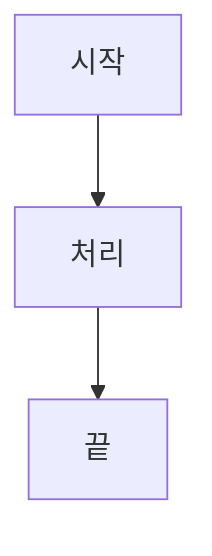

# 정보·컴퓨터 1강

## 수식
인라인 $a_i = b_j + c$ 와 디스플레이:
$$E = mc^2$$

## 코드
```python
def hello():
    print("안녕하세요")
```

## 표
| 항목 | 값 |
|---|---|
| 가 | 1 |
| 나 | 2 |

## 체크박스 / 각주
- [x] 1강 완료
- [ ] 2강 예정

중요한 개념[^note] 입니다.

[^note]: 각주 내용입니다.

## 다이어그램


## 이미지

